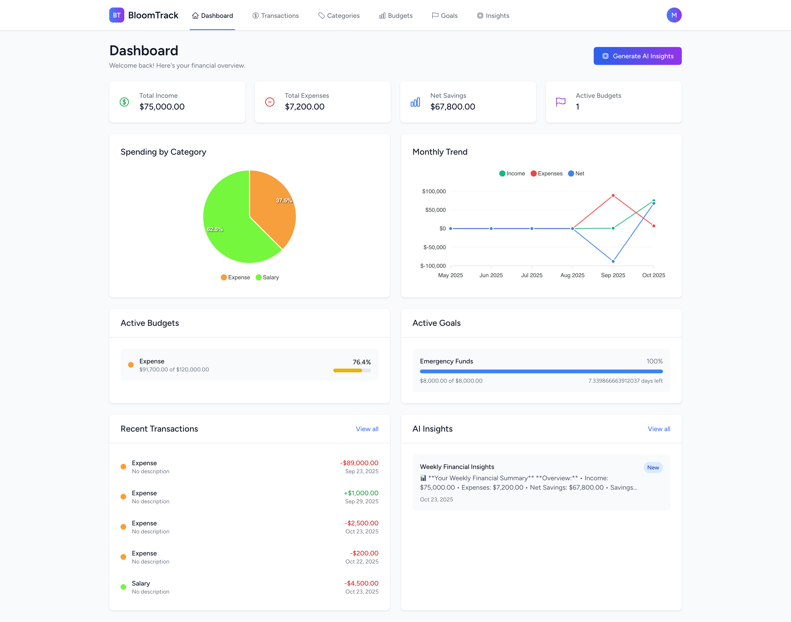

# 🌱 BloomTrack - Personal Finance Tracker with AI Insights

A modern, full-stack personal finance dashboard built with **Laravel 12**, **Vue 3**, **Inertia.js**, and **TailwindCSS**. BloomTrack helps users track expenses, manage budgets, set financial goals, and receive AI-powered insights about their spending patterns.

## 📸 Dashboard Preview



## 📋 Table of Contents

- [Overview](#-overview)
- [Features](#-features)
- [Technology Stack](#️-technology-stack)
- [Installation & Setup](#-installation--setup)
- [Usage Guide](#-usage-guide)
- [Project Structure](#-project-structure)
- [Deployment](#-deployment)
- [Contributing](#-contributing)
- [License](#-license)

## 🎯 Overview

BloomTrack is a comprehensive personal finance management application that empowers users to take control of their financial future. With intelligent AI-powered insights, beautiful visualizations, and intuitive interfaces, managing your money has never been easier.

## 🌟 Features

### 💰 Transaction Management
- Add, edit, and delete income/expenses
- Categorize transactions with custom categories
- Filter by date range, category, and amount
- CSV import for bulk transaction uploads
- Recurring transaction support
- Transaction tags and notes

### 📊 Analytics Dashboard
- Real-time financial overview
- Interactive charts (spending by category, monthly trends)
- Budget tracking with visual alerts
- Goal progress monitoring
- Recent transactions display

### 🤖 AI-Powered Insights
- Weekly and monthly AI-generated financial reports
- Personalized spending recommendations
- Pattern recognition and trend analysis
- OpenAI GPT-4 integration for intelligent insights

### 🎯 Goal Tracking
- Set and track financial goals
- Progress visualization
- Automatic goal completion detection
- Goal status management (active, completed, paused, cancelled)

### 💵 Budget Management
- Create budgets for different categories
- Visual budget progress tracking
- Over-budget alerts
- Budget period management

### 🏷️ Category Management
- Custom income and expense categories
- Color-coded categories
- Icon support for better visualization
- Category usage statistics

## 🛠️ Technology Stack

| Layer | Technology |
|-------|------------|
| **Backend** | Laravel 12 (latest) |
| **Frontend** | Vue 3 + Inertia.js |
| **Styling** | TailwindCSS + Heroicons |
| **Charts** | ApexCharts |
| **AI** | OpenAI GPT-4 API |
| **Database** | SQLite (development) / MySQL (production) |
| **Cache & Queue** | Database |
| **Authentication** | Laravel Breeze |
| **PDF Export** | DomPDF |
| **File Uploads** | Laravel Media Library |

## 🚀 Installation & Setup

### Prerequisites

Before you begin, ensure you have the following installed on your system:

| Requirement | Version | Purpose |
|------------|---------|---------|
| **PHP** | 8.2 or higher | Backend runtime |
| **Composer** | Latest | PHP dependency manager |
| **Node.js** | 18 or higher | JavaScript runtime |
| **npm** | Latest | Node package manager |
| **SQLite** | 3.x | Database (development) |
| **Git** | Latest | Version control |

### Quick Setup (Automated)

For a quick automated setup, run:

```bash
# Clone the repository
git clone https://github.com/jam-afaq/bloomtrack-finance-tracker
cd bloomtrack

# Run automated setup
composer setup
```

This will:
- Install all PHP and Node.js dependencies
- Copy `.env.example` to `.env`
- Generate application key
- Run database migrations
- Build frontend assets

### Manual Setup (Step-by-Step)

If you prefer manual setup or need more control:

#### 1. Clone the Repository

```bash
git clone https://github.com/jam-afaq/bloomtrack-finance-tracker
cd bloomtrack
```

#### 2. Install Dependencies

```bash
# Install PHP dependencies
composer install

# Install Node.js dependencies
npm install
```

#### 3. Environment Configuration

```bash
# Copy environment file
cp .env.example .env

# Generate application key
php artisan key:generate
```

#### 4. Configure Environment Variables

Open `.env` file and configure the following:

```env
# Application
APP_NAME=BloomTrack
APP_ENV=local
APP_DEBUG=true
APP_URL=http://localhost:8000

# Database (SQLite for development)
DB_CONNECTION=sqlite
# DB_DATABASE=/absolute/path/to/database.sqlite

# OpenAI Integration (Required for AI Insights)
OPENAI_API_KEY=your_openai_api_key_here
OPENAI_ORGANIZATION=your_organization_id_here

# Mail Configuration (Optional)
MAIL_MAILER=smtp
MAIL_HOST=mailhog
MAIL_PORT=1025
```

**Important:** Get your OpenAI API key from [OpenAI Platform](https://platform.openai.com/api-keys)

#### 5. Database Setup

```bash
# Create SQLite database file (if using SQLite)
touch database/database.sqlite

# Run migrations
php artisan migrate

# Seed default categories
php artisan db:seed --class=CategorySeeder
```

#### 6. Build Frontend Assets

```bash
# For development (with hot reload)
npm run dev

# For production
npm run build
```

#### 7. Start Development Server

**Option A: Single Command (Recommended)**
```bash
composer dev
```
This starts Laravel server, queue worker, logs, and Vite dev server concurrently.

**Option B: Multiple Terminals**
```bash
# Terminal 1 - Laravel server
php artisan serve

# Terminal 2 - Vite dev server
npm run dev

# Terminal 3 - Queue worker (optional, for background jobs)
php artisan queue:work
```

#### 8. Access the Application

1. Open your browser and navigate to: **http://localhost:8000**
2. Click **Register** to create a new account
3. Fill in your details and start tracking your finances!

### Troubleshooting

#### Database Connection Issues
```bash
# Clear config cache
php artisan config:clear

# Verify database file exists
ls -la database/database.sqlite
```

#### Permission Issues
```bash
# Fix storage permissions
chmod -R 775 storage bootstrap/cache
```

#### Asset Build Issues
```bash
# Clear npm cache
npm cache clean --force

# Reinstall dependencies
rm -rf node_modules package-lock.json
npm install
```

#### Port Already in Use
```bash
# Use a different port
php artisan serve --port=8001
```

## 📱 Usage Guide

### Getting Started

1. **Create an Account** - Register with your email and password
2. **Explore Dashboard** - View your financial overview with charts and stats
3. **Add Transactions** - Record your income and expenses
4. **Set Budgets** - Define spending limits for different categories
5. **Track Goals** - Set financial objectives and monitor progress
6. **Generate AI Insights** - Get personalized financial recommendations

### Key Features

| Feature | Description | Location |
|---------|-------------|----------|
| **Dashboard** | View financial overview, charts, and recent activity | Home page |
| **Transactions** | Add, edit, delete, and filter transactions | `/transactions` |
| **Budgets** | Create and monitor spending budgets | `/budgets` |
| **Goals** | Set and track financial goals | `/goals` |
| **Categories** | Manage income/expense categories | `/categories` |
| **AI Insights** | Generate intelligent financial reports | Dashboard → "Generate Insights" |
| **Reports** | Export financial data and reports | `/reports` |

## 📁 Project Structure

```
bloomtrack/
├── app/
│   ├── Http/
│   │   ├── Controllers/          # Request handlers
│   │   │   ├── DashboardController.php
│   │   │   ├── TransactionController.php
│   │   │   ├── BudgetController.php
│   │   │   ├── GoalController.php
│   │   │   └── CategoryController.php
│   │   ├── Middleware/           # HTTP middleware
│   │   └── Requests/             # Form requests
│   ├── Models/                   # Eloquent ORM models
│   │   ├── User.php
│   │   ├── Transaction.php
│   │   ├── Budget.php
│   │   ├── Goal.php
│   │   └── Category.php
│   ├── Services/                 # Business logic
│   │   └── AIInsightService.php
│   └── Policies/                 # Authorization
├── database/
│   ├── migrations/               # Database schema
│   ├── seeders/                  # Sample data
│   └── database.sqlite           # SQLite database
├── resources/
│   ├── js/
│   │   ├── Components/           # Reusable Vue components
│   │   │   ├── TransactionForm.vue
│   │   │   ├── BudgetCard.vue
│   │   │   ├── GoalProgress.vue
│   │   │   └── Charts/
│   │   ├── Layouts/              # Page layouts
│   │   │   ├── AppLayout.vue
│   │   │   └── GuestLayout.vue
│   │   ├── Pages/                # Inertia.js pages
│   │   │   ├── Dashboard.vue
│   │   │   ├── Transactions/
│   │   │   ├── Budgets/
│   │   │   └── Goals/
│   │   └── app.js                # Main JS entry
│   └── css/
│       └── app.css               # TailwindCSS styles
├── routes/
│   ├── web.php                   # Web routes
│   ├── api.php                   # API routes
│   └── auth.php                  # Auth routes
├── public/                       # Public assets
├── storage/                      # File storage
├── tests/                        # Test suites
├── .env.example                  # Environment template
├── composer.json                 # PHP dependencies
├── package.json                  # Node dependencies
└── README.md                     # This file
```

## 🗄️ Database Schema

### Core Tables

| Table | Description | Key Fields |
|-------|-------------|------------|
| **users** | User accounts | id, name, email, password |
| **categories** | Income/expense categories | id, name, type, color, icon |
| **transactions** | Financial records | id, user_id, category_id, amount, type, date |
| **budgets** | Spending limits | id, user_id, category_id, amount, period |
| **goals** | Financial objectives | id, user_id, name, target_amount, current_amount |
| **insights** | AI-generated reports | id, user_id, content, type, generated_at |

### Relationships

- User **has many** Transactions, Budgets, Goals, Insights
- Transaction **belongs to** User, Category
- Budget **belongs to** User, Category
- Goal **belongs to** User
- Category **has many** Transactions, Budgets

## 🚀 Deployment

### Production Requirements

| Component | Requirement |
|-----------|-------------|
| **Server** | VPS or Cloud (AWS, DigitalOcean, etc.) |
| **PHP** | 8.2+ with extensions: BCMath, Ctype, JSON, Mbstring, OpenSSL, PDO, Tokenizer, XML |
| **Database** | MySQL 8.0+ or PostgreSQL 13+ |
| **Web Server** | Nginx or Apache |
| **SSL** | Required for production |
| **Memory** | Minimum 512MB RAM |

### Deployment Steps

#### 1. Server Setup

```bash
# Update system
sudo apt update && sudo apt upgrade -y

# Install required packages
sudo apt install php8.2 php8.2-fpm php8.2-mysql php8.2-xml php8.2-mbstring php8.2-curl nginx mysql-server -y
```

#### 2. Clone and Configure

```bash
# Clone repository
git clone <repository-url> /var/www/bloomtrack
cd /var/www/bloomtrack

# Install dependencies
composer install --optimize-autoloader --no-dev
npm install && npm run build

# Set permissions
sudo chown -R www-data:www-data storage bootstrap/cache
sudo chmod -R 775 storage bootstrap/cache
```

#### 3. Environment Configuration

```env
APP_ENV=production
APP_DEBUG=false
APP_URL=https://yourdomain.com

DB_CONNECTION=mysql
DB_HOST=127.0.0.1
DB_PORT=3306
DB_DATABASE=bloomtrack
DB_USERNAME=your_db_user
DB_PASSWORD=your_db_password

OPENAI_API_KEY=your_production_api_key
```

#### 4. Database Migration

```bash
php artisan migrate --force
php artisan db:seed --class=CategorySeeder
```

#### 5. Optimize for Production

```bash
php artisan config:cache
php artisan route:cache
php artisan view:cache
php artisan optimize
```

#### 6. Configure Web Server (Nginx)

```nginx
server {
    listen 80;
    server_name yourdomain.com;
    root /var/www/bloomtrack/public;

    add_header X-Frame-Options "SAMEORIGIN";
    add_header X-Content-Type-Options "nosniff";

    index index.php;

    charset utf-8;

    location / {
        try_files $uri $uri/ /index.php?$query_string;
    }

    location = /favicon.ico { access_log off; log_not_found off; }
    location = /robots.txt  { access_log off; log_not_found off; }

    error_page 404 /index.php;

    location ~ \.php$ {
        fastcgi_pass unix:/var/run/php/php8.2-fpm.sock;
        fastcgi_param SCRIPT_FILENAME $realpath_root$fastcgi_script_name;
        include fastcgi_params;
    }

    location ~ /\.(?!well-known).* {
        deny all;
    }
}
```

#### 7. Setup SSL with Let's Encrypt

```bash
sudo apt install certbot python3-certbot-nginx -y
sudo certbot --nginx -d yourdomain.com
```

#### 8. Setup Queue Worker (Optional)

```bash
# Create supervisor config
sudo nano /etc/supervisor/conf.d/bloomtrack-worker.conf
```

Add:
```ini
[program:bloomtrack-worker]
process_name=%(program_name)s_%(process_num)02d
command=php /var/www/bloomtrack/artisan queue:work --sleep=3 --tries=3
autostart=true
autorestart=true
user=www-data
numprocs=1
redirect_stderr=true
stdout_logfile=/var/www/bloomtrack/storage/logs/worker.log
```

```bash
sudo supervisorctl reread
sudo supervisorctl update
sudo supervisorctl start bloomtrack-worker:*
```

## 🧪 Testing

Run the test suite:

```bash
# Run all tests
php artisan test

# Run specific test suite
php artisan test --testsuite=Feature

# Run with coverage
php artisan test --coverage
```

## 🤝 Contributing

We welcome contributions! Here's how you can help:

1. **Fork** the repository
2. **Create** a feature branch (`git checkout -b feature/AmazingFeature`)
3. **Commit** your changes (`git commit -m 'Add some AmazingFeature'`)
4. **Push** to the branch (`git push origin feature/AmazingFeature`)
5. **Open** a Pull Request

### Coding Standards

- Follow PSR-12 coding standards for PHP
- Use ESLint and Prettier for JavaScript/Vue
- Write meaningful commit messages
- Add tests for new features
- Update documentation as needed

## 📄 License

This project is open-sourced software licensed under the **MIT License**.

## 🆘 Support & Contact

- **Issues**: [GitHub Issues](https://github.com/jam-afaq/bloomtrack-finance-tracker/issues)
- **Discussions**: [GitHub Discussions](https://github.com/jam-afaq/bloomtrack-finance-tracker/discussions)
- **LinkedIn**: [Mohammad Afaq](https://www.linkedin.com/in/mohammad-afaq/)

## 🙏 Acknowledgments

- Laravel Framework
- Vue.js Community
- OpenAI for GPT-4 API
- TailwindCSS Team
- All contributors

## 🔮 Roadmap

### Upcoming Features

- [ ] Mobile application (React Native)
- [ ] Bank account integration
- [ ] Multi-currency support
- [ ] Advanced analytics and reporting
- [ ] Team/family budget sharing
- [ ] Investment portfolio tracking
- [ ] Automated bill reminders
- [ ] Receipt scanning with OCR
- [ ] Financial goal recommendations
- [ ] Export to accounting software

---

<div align="center">

**🌱 BloomTrack** - Take control of your financial future with AI-powered insights!

Made with ❤️ by [Muhammad Afaq](https://www.linkedin.com/in/mohammad-afaq/)

[⭐ Star us on GitHub](https://github.com/jam-afaq/bloomtrack-finance-tracker) | [🐛 Report Bug](https://github.com/jam-afaq/bloomtrack-finance-tracker/issues) | [💼 LinkedIn](https://www.linkedin.com/in/mohammad-afaq/)

</div>